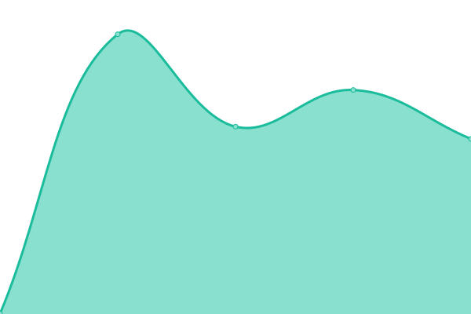
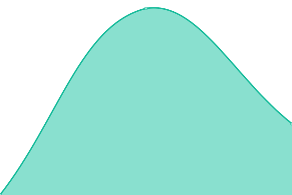
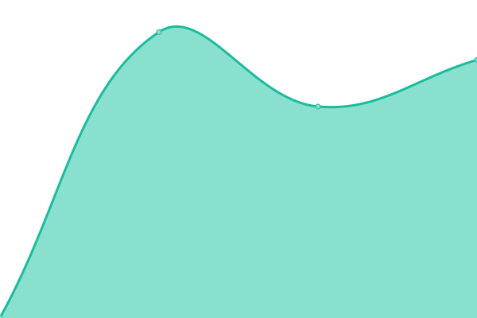

# [📈 Live Status](https://JeronimoTaber.github.io/upptimeMapp): <!--live status--> **🟩 All systems operational**

This repository contains the open-source uptime monitor and status page for [JeronimoTaber](https://JeronimoTaber.github.io/upptimeMapp), powered by [Upptime](https://github.com/upptime/upptime).

With [Upptime](https://upptime.js.org), you can get your own unlimited and free uptime monitor and status page, powered entirely by a GitHub repository. We use [Issues](https://github.com/JeronimoTaber/upptimeMapp/issues) as incident reports, [Actions](https://github.com/JeronimoTaber/upptimeMapp/actions) as uptime monitors, and [Pages](https://JeronimoTaber.github.io/upptimeMapp) for the status page.

<!--start: status pages-->
<!-- This summary is generated by Upptime (https://github.com/upptime/upptime) -->
<!-- Do not edit this manually, your changes will be overwritten -->
<!-- prettier-ignore -->
| URL | Status | History | Response Time | Uptime |
| --- | ------ | ------- | ------------- | ------ |
|  [Mapp Jornales](https://jornales.mapp.com.ar/) | 🟩 Up | [mapp-jornales.yml](https://github.com/JeronimoTaber/upptimeMapp/commits/HEAD/history/mapp-jornales.yml) | 

 880ms
     
 | 

<a href="https://JeronimoTaber.github.io/upptimeMapp/history/mapp-jornales">100.00%</a>
    

|  [Masturismo](https://masturismo.mapp.com.ar/) | 🟩 Up | [masturismo.yml](https://github.com/JeronimoTaber/upptimeMapp/commits/HEAD/history/masturismo.yml) | 

 1752ms
     
 | 

<a href="https://JeronimoTaber.github.io/upptimeMapp/history/masturismo">100.00%</a>
    

|  [Mapp Ondemand](https://ondemand.mapp.com.ar/) | 🟩 Up | [mapp-ondemand.yml](https://github.com/JeronimoTaber/upptimeMapp/commits/HEAD/history/mapp-ondemand.yml) | 

 1008ms
     
 | 

<a href="https://JeronimoTaber.github.io/upptimeMapp/history/mapp-ondemand">100.00%</a>
    

|  [Mapp Consorcios](https://consorcios.mapp.com.ar/) | 🟩 Up | [mapp-consorcios.yml](https://github.com/JeronimoTaber/upptimeMapp/commits/HEAD/history/mapp-consorcios.yml) | 

 950ms
     
 | 

<a href="https://JeronimoTaber.github.io/upptimeMapp/history/mapp-consorcios">100.00%</a>
    

|  [Mapp Aventura](https://aventura.mapp.com.ar/) | 🟩 Up | [mapp-aventura.yml](https://github.com/JeronimoTaber/upptimeMapp/commits/HEAD/history/mapp-aventura.yml) | 

 930ms
     
 | 

<a href="https://JeronimoTaber.github.io/upptimeMapp/history/mapp-aventura">100.00%</a>
    

|  [La Mercantil](https://www.mercantilandina.com.ar/) | 🟩 Up | [la-mercantil.yml](https://github.com/JeronimoTaber/upptimeMapp/commits/HEAD/history/la-mercantil.yml) | 

 1131ms
     
 | 

<a href="https://JeronimoTaber.github.io/upptimeMapp/history/la-mercantil">100.00%</a>
    

<!--end: status pages-->

[**Visit our status website →**](https://JeronimoTaber.github.io/upptimeMapp)

## 📄 License

- Powered by: [Upptime](https://github.com/upptime/upptime)
- Code: [MIT](./LICENSE) © [JeronimoTaber](https://JeronimoTaber.github.io/upptimeMapp)
- Data in the `./history` directory: [Open Database License](https://opendatacommons.org/licenses/odbl/1-0/)
